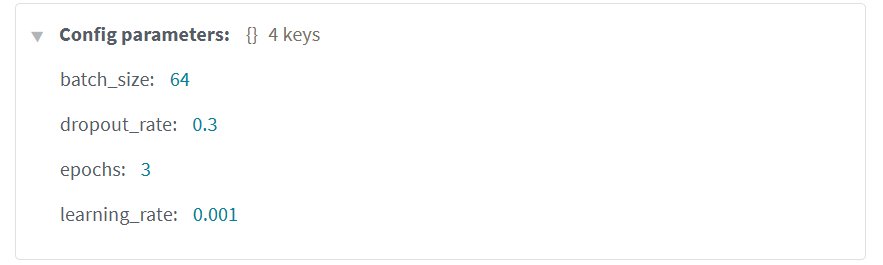
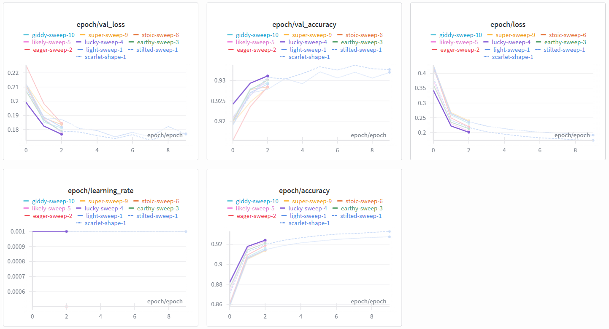
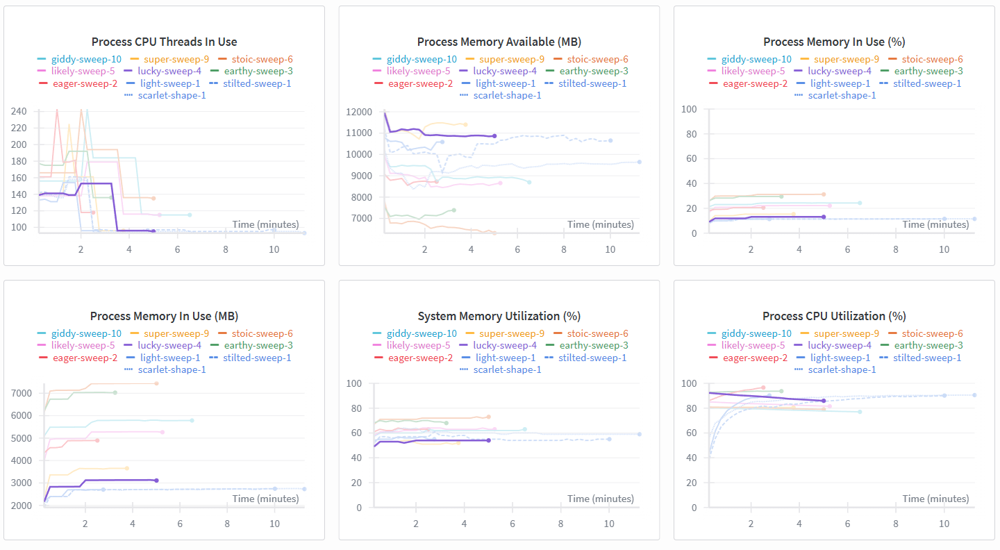
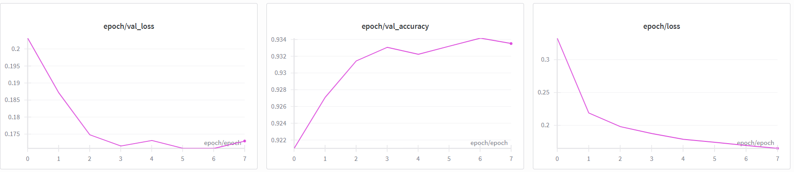

# Air-Writer: Real-Time Handwritten Character Recognition using Hand Gestures

    

Air-Writer allows you to write letters (A-Z) and numbers (0-9) in the air using your index finger, recognized in real-time via your webcam. Specific hand gestures control the writing, classification, and deletion process.

## Demo


## Features

* **Real-Time Hand Tracking:** Utilizes MediaPipe Hands for precise index finger tracking.
* **Gesture Control:** Implements an intuitive gesture system for application control:
    * **Write:** Index finger extended.
    * **Classify:** Full open palm triggers recognition.
    * **Delete:** Pinky finger extended removes the last character.
    * **Standby:** Other gestures pause writing ("pen up").
* **CNN-Based Recognition:** Employs a TensorFlow/Keras Convolutional Neural Network trained on a filtered EMNIST dataset (36 classes: A-Z, 0-9).
* **Live Feedback:** Displays the drawing trail and recognized text overlay directly on the webcam feed.

## How It Works

The application follows this processing pipeline:

1.  **Camera Input:** Captures video frames using OpenCV (`cv2.VideoCapture`).
2.  **Hand Detection:** Processes frames with MediaPipe Hands to detect hand landmarks.
3.  **Gesture Recognition:** Determines the current gesture (`write`, `classify`, `delete`, `standby`) based on finger counts derived from landmark positions.
4.  **Drawing:**
    * **Visible Trail:** A smoothed black line tracks the index finger on the displayed video frame.
    * **Internal Canvas:** A thicker white line is drawn concurrently on a hidden canvas, serving as the input for the ML model.
5.  **Preprocessing (`preprocessing.py`):** On the 'classify' gesture, the internal canvas image is converted to grayscale, cropped to the drawing's bounding box, padded to maintain aspect ratio, and resized to 28x28 pixels. Blank canvases are returned as empty images (representing spaces).
6.  **Prediction:** The 28x28 image is normalized and fed into the pre-trained TensorFlow/Keras CNN model (`model.predict`).
7.  **Output Management:** The recognized character or space is added to the sentence. The 'delete' gesture removes the last character.
8.  **Display:** The current sentence is overlaid with a background onto the video frame using OpenCV (`cv2.putText`).

## Gestures

Control the application using these simple hand gestures:

* ☝️ **Write:** Extend only your index finger. Move your finger to draw.
* 🖐️ **Classify/Submit:** Open your hand fully (all 5 fingers extended). This recognizes the drawn character and clears the drawing area.
* 🤙 **Delete:** Extend only your pinky finger. This removes the last recognized character.
* ✊ / 👍 / etc. **Standby:** Any other gesture stops the drawing process ("pen up").

## Setup and Installation

**Prerequisites:**

* Python 3.11+
* `pip` (Python package installer)
* Git

**Steps:**

1.  **Clone the repository:**
    ```bash
    git clone https://github.com/MedDhiaH4/air-writer.git
    cd air-writer
    ```

2.  **Create and activate a virtual environment:**
    ```bash
    # Create the environment
    python -m venv venv

    # Activate on Windows (PowerShell)
    .\venv\Scripts\Activate.ps1

    # Activate on macOS/Linux
    # source venv/bin/activate
    ```

3.  **Install dependencies:**
    ```bash
    pip install -r requirements.txt
    ```

## How to Run

1.  Make sure your virtual environment is activated.
2.  Run the main script:
    ```bash
    python main.py
    ```
3.  An OpenCV window will open showing your webcam feed. Use the gestures described above.
4.  **Keyboard Controls:**
    * Press `q` to quit the application.
    * Press `c` to manually clear the current drawing and the recognized text.

## Model Training & Evaluation (Weights & Biases)

* **Dataset:** The model was trained on the EMNIST ByClass dataset, filtered to include 36 classes (digits 0-9 and uppercase letters A-Z). Images were preprocessed (normalized, transposed) before training.
* **Architecture:** A simple Convolutional Neural Network (CNN) built with TensorFlow/Keras (see `model.py`).
* **Hyperparameter Tuning:** Weights & Biases (W&B) Sweeps were utilized to optimize hyperparameters. 10 random trials were run exploring:
    * `learning_rate`: [0.001, 0.0005, 0.0001]
    * `batch_size`: [64, 128]
    * `dropout_rate`: [0.3, 0.4, 0.5]
    * `epochs`: 5 (for sweep runs)

* **Best Model:** The final model was trained for 8 epochs using the best parameters identified by the W&B sweep, achieving ~93.4% validation accuracy.
    * **Winning Parameters:**
        * `learning_rate`: 0.001
        * `batch_size`: 64
        * `dropout_rate`: 0.3

    * Configuration of Best Run ("lucky-sweep-5"):
        

    * Sweep Results Overview (val_accuracy, val_loss - Purple line "lucky-sweep-5" was best):
        

    * System Utilization During Sweeps (Example):
        

    * Final Model Training Performance (8 Epochs):
        

## License

MIT License - Copyright (c) 2025 MDH